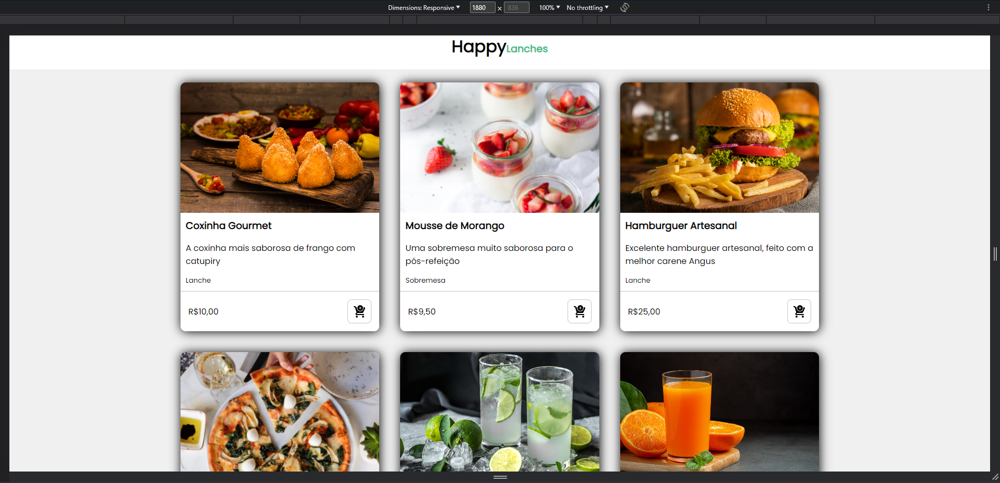
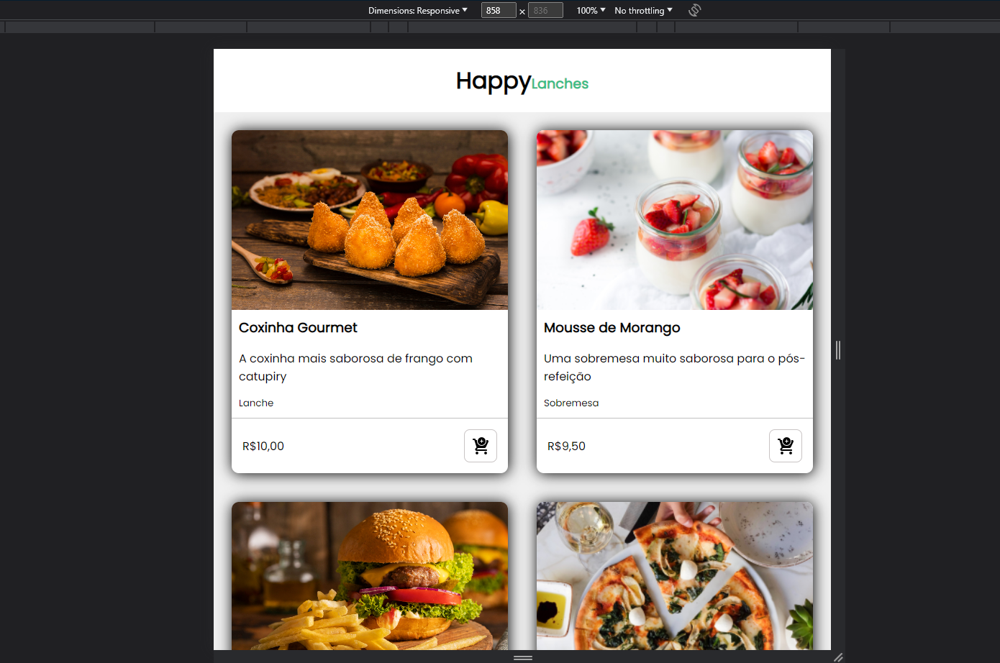
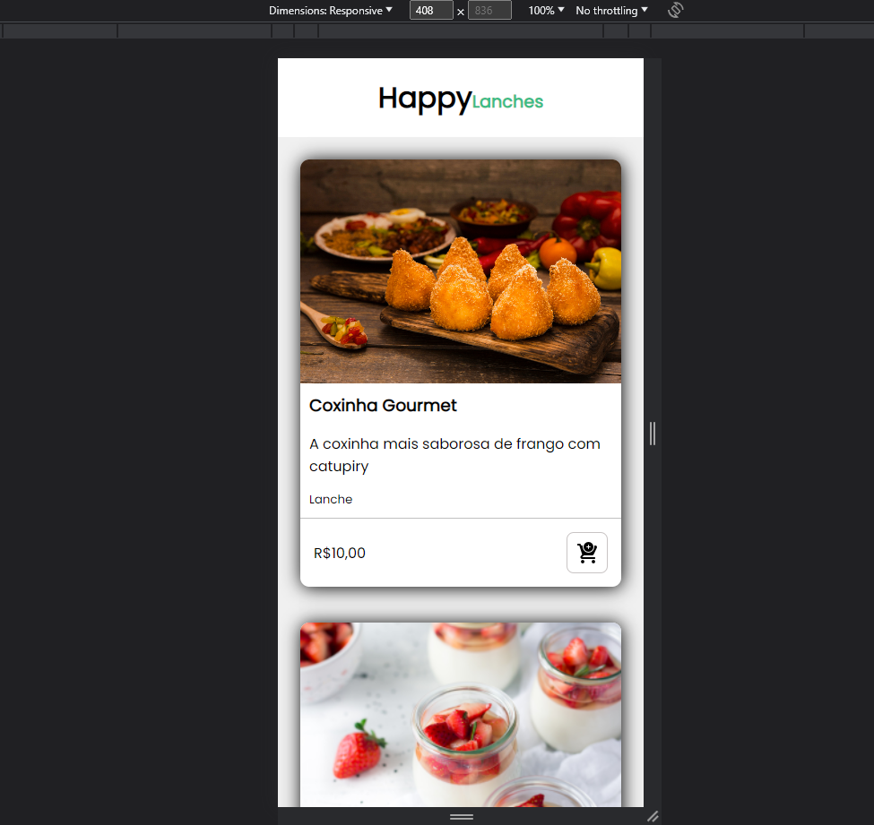

Um mini-projeto realizado para praticar responsividade com o uso de Flex-Box.

O projeto HappyLanches tem como proposta apresentar cards com alguns alimentos. O site se ajusta a diferentes tamanhos de telas.

Telas de computadores:

Telas de tablets:

Telas de celulares:

